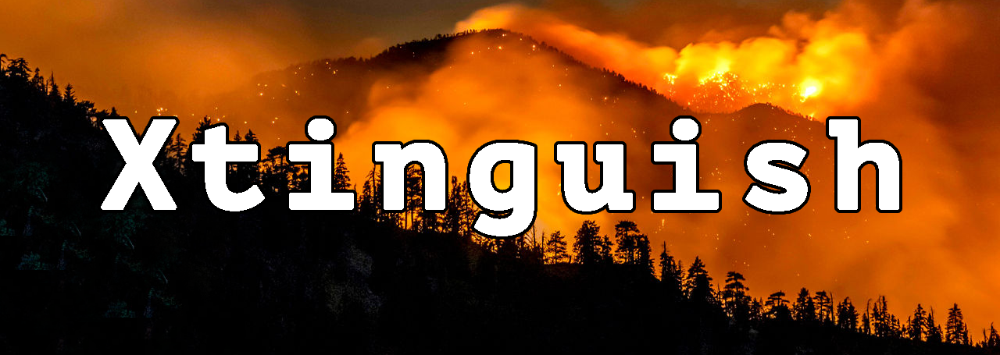
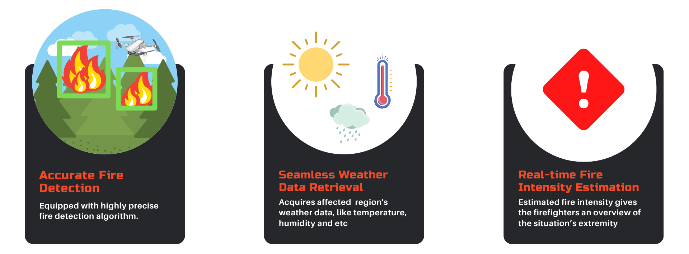
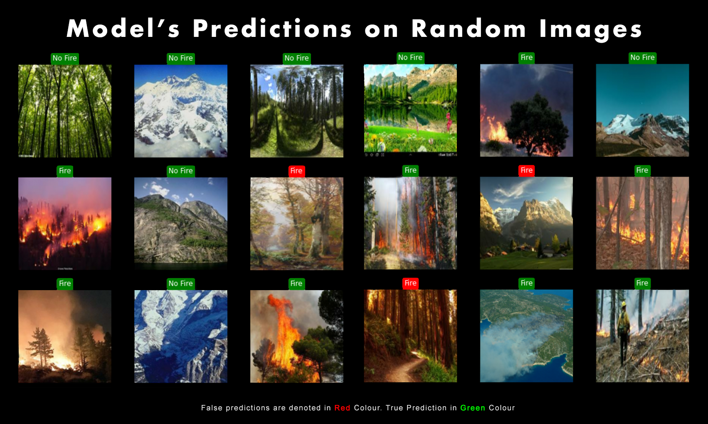

<p align="center">
  <a href="https://doi.org/10.1007/s42979-022-01160-7"></a>

</p>

 ## What is Xtinguish ?
As a result of rising global temperatures, wildfires have destroyed millions of acres of land, thousands of structures, and tens of thousands of homes. The majority of wildfires are caused by human activity, which cannot be predicted based solely on climate conditions. Consequently, to detect wildfires prior to their escalation, we propose **Xtinguish**, which is equipped with a CNN image classification model trained on a wildfire imagery dataset to detect a possible flame or smoke in an image.

## How to use it ?

In addition, our algorithm generates weather information and the fire's intensity. In contrast to existing wildfire detection systems, our proposed solution is a amalgam of the Internet of Things (IoT) and Machine Learning that aims to provide a one-stop shop for all the needs necessary to minimise wildfire damage.

## What it does ?

 **Xtinguish** takes an image as a input and,
1. Detects if there's a possible Fire or Smoke in it. 

2. Taking advantage of [**`OpenWeatherAPI`**](https://openweathermap.org), generates **Weather Data** based of geo-location.

3. **Xtinguish** also attempts to predict the **Fire Intensity** solely based on the image.



 > **How is Xtinguish, different from other Image Classifiers ?**
 > 
 > **Answer :** At the time of writing, no other Model out there performs all the above mentioned tasks at one spot. 

 ## How is it built ?

Leveraging the power of **Transfer Learning**, **Xtinguish** adapts the architecture and weights of a pre-built Convolutional Neural Network Architecture, **`EfficientNetB0`** which was initially trained on the infamous **[`ImageNET`](https://www.image-net.org)** dataset.

Further trained on custom dataset, it classifies a given image into `No Fire`, `Fire`. On being tested on various images and benchmark datasets, **Xtinguish** acheived a high accuracy of **`98%`**. 


---
---
#### Cite the work
```
@Article{Sethuraman2022,
author={Sethuraman, Sibi Chakkaravarthy and Tadkapally, Gaurav Reddy and Mohanty, Saraju P. and Subramanian, Anitha},
title={iDrone: IoT-Enabled Unmanned Aerial Vehicles for Detecting Wildfires Using Convolutional Neural Networks},
journal={SN Computer Science},
year={2022},
doi={10.1007/s42979-022-01160-7},
url={https://doi.org/10.1007/s42979-022-01160-7}
}
```

