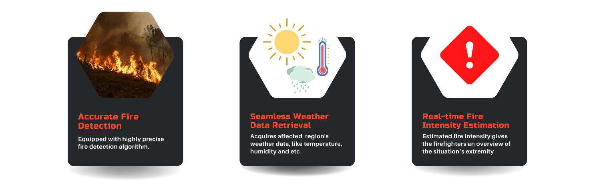

<p align="center">
  <a href="https://doi.org/10.1007/s42979-022-01160-7"></a>

</p>

 ## What is Xtinguish ?
Due to increasing world temperatures, wildfires have destroyed millions of acres of land, thousands of structures, and homes. Most wildfires are due to anthropogenic factors, which cannot be predicted solely based on climate conditions. Henceforth, to detect wildfires before escalating, we propose **Xtinguish**, equipped with an end-to-end CNN image classification model, trained on a wildfire imagery dataset to detect a possible flame or smoke in an image. 

## How to use it ?

In addition, it will also output the weather data and the intensity of the fire. Contrasting with existing wildfire detection systems, our proposed solution is a fusion of the Internet of Things (IoT) and Machine Learning, aiming to provide a one-stop solution for all the needs required to minimize the damage caused by wildfires.

## What it does ?

 **Xtinguish** takes an image as a input and,
1. Detects if there's a possible Fire or Smoke in it. 

2. Taking advantage of [**`OpenWeatherAPI`**](https://openweathermap.org), it outputs the **Weather Data** based on your location.

3. **Xtinguish** also attempts to predict the **Fire Intensity** based on the image.

   

 > **How is Xtinguish, different from other Image Classifiers ?**
 > 
 > **Answer :** At the time of writing, no other Model out there performs all the above mentioned tasks at one spot. 

 ## How is it built ?

Leveraging on power of **Transfer Learning**, **Xtinguish** adapts the architecture and weights of a pre-built Convultional Neural Network Model, **`EfficientNetB0`** which was initially trained on the infamous **[`ImageNET`](https://www.image-net.org)** dataset.

Further trained on custom dataset, it classifies a given image into `No Fire`, `Fire`. On being tested on various images and benchmark datasets, **Xtinguish** acheived a high accuracy of **`98%`**. 


---
---
#### Cite the work
```
@Article{Sethuraman2022,
author={Sethuraman, Sibi Chakkaravarthy and Tadkapally, Gaurav Reddy and Mohanty, Saraju P. and Subramanian, Anitha},
title={iDrone: IoT-Enabled Unmanned Aerial Vehicles for Detecting Wildfires Using Convolutional Neural Networks},
journal={SN Computer Science},
year={2022},
doi={10.1007/s42979-022-01160-7},
url={https://doi.org/10.1007/s42979-022-01160-7}
}
```

